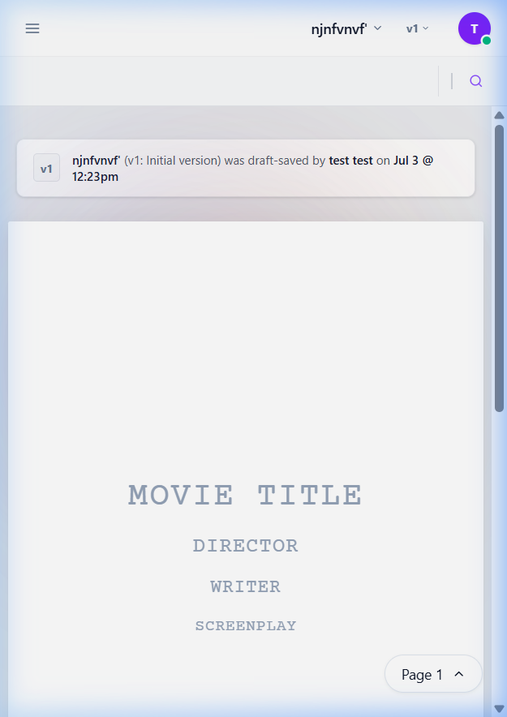

# 🎬 Movie Script Writer

A premium, interactive web-based screenplay editor that automatically formats scripts to standard industry specifications. Built with React and Spring Boot, it features page-by-page editor styling (supporting both A4 and US Letter formats), real-time database persistence, custom watermarking, version history, and pixel-perfect PDF export synchronized exactly with the editor layout.

---

## ✨ Features

- **Standard Screenplay Formatting**: Auto-format elements such as *Scene Heading, Action, Character, Dialogue, Parenthetical, Transition*, and *Shot* using hotkeys or toolbar selectors.
- **Title Page Setup**: Easily create a dedicated Title Page (Page 1) with vertically centered Title, Writer, Director, and Screenplay fields.
- **Page Layout & Auto-Zoom**: Supports **A4** and **US Letter** standards with real-time pagination, margins, and auto-zoom to fit mobile screens.
- **Custom Watermarks**: Apply custom, rotated watermarks centered on every page (automatically skipping Page 1 / Title Page) with configurable opacity.
- **PDF & DOCX Export**: One-click download options. The PDF export matches the browser's pagination exactly, preventing layout drift.
- **Version Control**: Built-in script history to capture manual and automatic snapshots so you can switch back to any version.
- **Collaboration & Public Sharing**: Generate public links to share read-only views of your screenplay.

---

## 📸 Screenshots

### 💻 Desktop Screenplay Editor


### 📄 Professional Title Page


### 📱 Responsive Mobile Layout


---

## 🛠️ Tech Stack

### Frontend
- **Framework**: React 18, Vite 6
- **Styling**: Tailwind CSS v4, Custom CSS variables
- **Icons**: React Icons (Fi, Md, Fa)
- **API Client**: Axios

### Backend
- **Core**: Java 21, Spring Boot 3
- **Security**: Spring Security + JWT Authentication
- **Database**: Neon PostgreSQL
- **PDF Library**: OpenPDF (fork of iText)
- **Containerization**: Docker (multi-stage build)

---

## 🚀 Setup & Local Running

### Prerequisites
- Node.js (v18+)
- JDK 21
- PostgreSQL database (local or cloud Neon instance)

### 1. Database Configuration
Create a PostgreSQL database and configure the connection in `scriptwriter-backend/src/main/resources/application.properties`:
```properties
spring.datasource.url=jdbc:postgresql://localhost:5432/neondb
spring.datasource.username=your_username
spring.datasource.password=your_password
```

### 2. Run Backend Server
Navigate to the backend directory and launch with Maven wrapper:
```bash
cd scriptwriter-backend
./mvnw.cmd spring-boot:run
```
The server will run on `http://localhost:8080`.

### 3. Run Frontend App
Navigate to the frontend directory, install dependencies, and start the Vite development server:
```bash
cd frontend
npm install
npm run dev
```
Open `http://localhost:5173` in your browser.

---

## 🌐 Production Deployment

- **Database**: Hosted on [Neon PostgreSQL](https://neon.tech/)
- **Backend**: Deployed on [Render](https://render.com/) via a Docker build pipeline (configured in [Dockerfile](scriptwriter-backend/Dockerfile))
- **Frontend**: Built and deployed to [Netlify](https://www.netlify.com/) (configured in [netlify.toml](netlify.toml))
